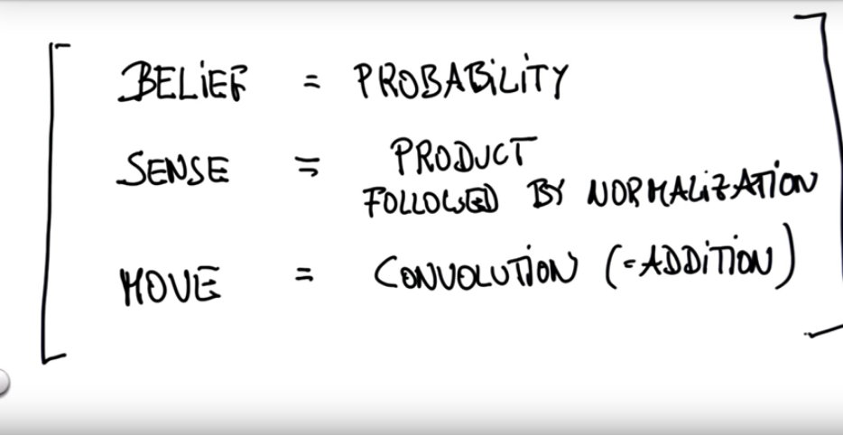
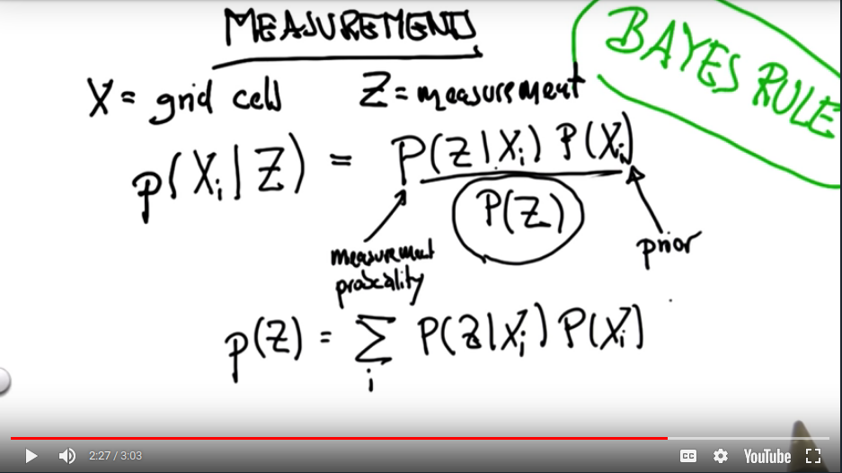
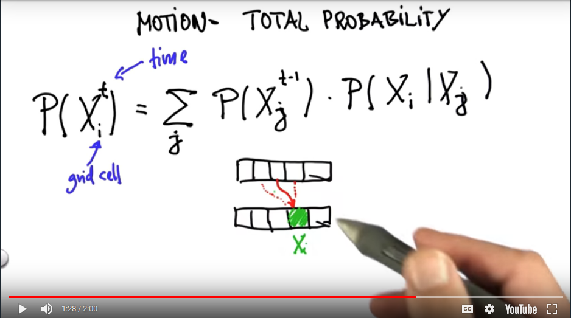

# Localization

---



From the above image the BELIEF is the current PROBABILITY DISTRIBUTION (initially it is a uniform probability distribution).

<br><br>

### SENSE / MEASUREMENT



The SENSE function is just the computation of the BAYES RULE. Here, the prior is the existing belief. The measurement probability is the considered the sensor accuracy. Thus, it is just the product followed by normalization.

```python
# posterior = measurement_probability * prior
q[i][j] = (hit*sensor_right + (1-hit)*(1-sensor_right)) * p[i][j]
```

<br><br>

### MOTION



The MOVE function is just the computation of the TOTAL PROBABILITY. Thus, it is a convolution operation.

```python
# probability_after_motion = probability_before_motion * transition_probability
q[i][j] = p[(i-motion[0])%len(p)][(j-motion[1])%len(p[i])] + ((1-p_move)*p[i][j]) * p_move

# if there exists overshoot or undershoot in 1D, then
s = pExact * p[(i-U) % len(p)]
s = s + pOvershoot * p[(i-U-1) % len(p)]
s = s + pUndershoot * p[(i-U+1) % len(p)]
q.append(s)
```


